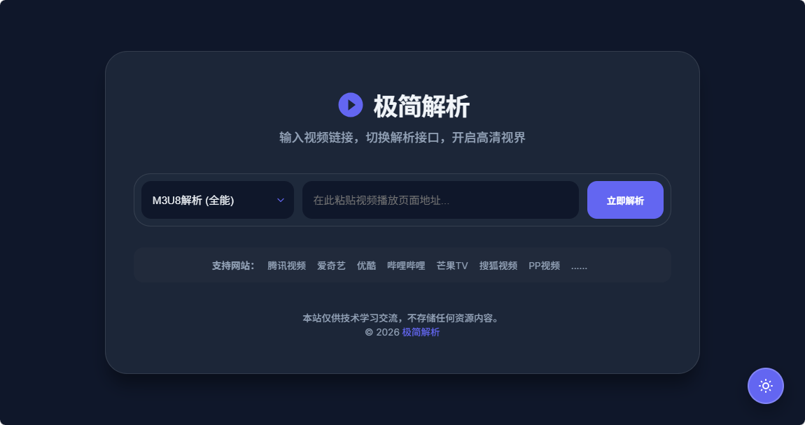
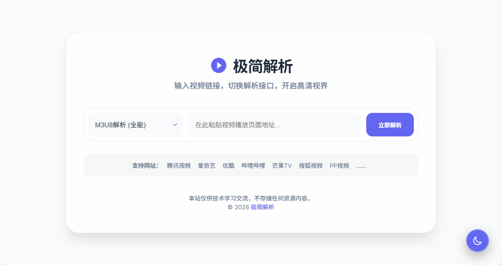

# 极简全网视频解析 (Minimalist Video Parser)

一个基于现代极简主义设计的静态网页工具，旨在提供纯净、无广告的全网视频解析体验。

## 📸 效果预览

### 暗黑模式 (默认)
 

### 明亮模式

## ✨ 项目亮点

- 🎨 **极简视觉设计**：采用毛玻璃效果 (Glassmorphism) 与现代排版，视觉大方美观。
- 🌓 **默认暗黑模式**：网页打开即为暗黑模式，保护视力。支持点击悬浮按钮实时切换。
- 📍 **固定悬浮按钮**：模式切换按钮固定在右下角，随时随地一键更换主题。
- 📱 **完美适配移动端**：针对手机端优化，输入框与按钮高度统一（54px），操作顺滑。
- 🎬 **影院模式自适应**：解析成功后，容器平滑扩展至 1200px 宽度，带来沉浸式观影体验。
- 🚀 **零依赖加载**：纯原生代码，引入 Google Fonts 与在线 SVG Favicon，加载极速。

## 🚀 快速开始

### 方案 A：GitHub Pages 部署 (最推荐)
1. 将 `index.html` 上传至你的 GitHub 仓库。
2. 进入仓库设置 **Settings** -> **Pages**。
3. 选择 `main` 分支并保存，稍等片刻即可通过 GitHub 提供的链接访问。

### 方案 B：本地运行
1. 下载 `index.html`。
2. 直接使用浏览器打开即可。

## 🛠️ 技术栈

- **Core**: HTML5 / CSS3 / Vanilla JavaScript
- **Typography**: [Inter](https://fonts.google.com/specimen/Inter) & [Noto Sans SC](https://fonts.google.com/specimen/Noto+Sans+SC)
- **Icons**: Inline SVG & SVG Data URI Favicon

## 📋 支持平台

本工具预设多个优质接口，支持解析以下平台：
- 腾讯视频、爱奇艺、优酷、哔哩哔哩 (Bilibili)、芒果TV、搜狐视频、PP视频等。

## ⚖️ 免责声明

1. 本项目仅供前端网页设计交流与技术学习使用，不存储任何视频资源，不参与任何视频解析过程。
2. 网页所引用的解析接口均来自互联网，版权归原作者所有。
3. 请勿将本项目用于任何商业用途，因使用产生的任何法律责任由使用者自行承担。

## 📄 开源协议

本项目遵循 [MIT License](LICENSE) 协议。
